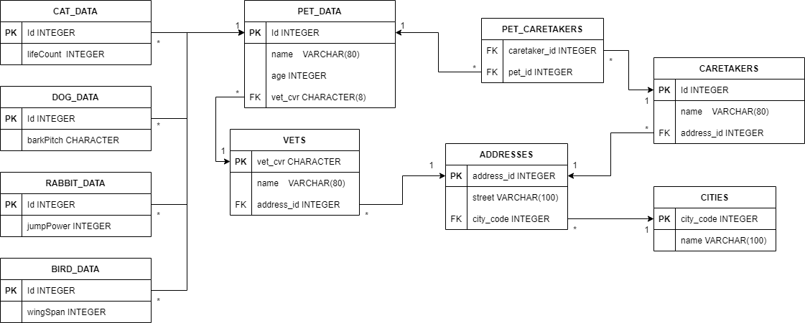

# Assignment 1 - Rational Databases
- Jonatan Bakke https://github.com/JonatanMagnusBakke
- Jonas Hein - https://github.com/Zenzus
- Thomas Ebsen - https://github.com/Srax 
- [Exercise Link](misc/Assignment.pfd)

## Setup
What you'll need:
1. PostgreSQL
2. PgAdmin or any other program that can connect to PostgreSQL
3. Your favorite IDE that can run java. We use IntelliJ

## How to run the project
1. Open your database program and create a database named VetDB
2. Run the [VetDB_Setup.sql](scripts/VetDB_Setup.sql) script to setup the database
3. Run the [VetDB_DesignatedUser.sql](scripts/VetDB_DesignatedUser.sql) script to create the user that we are going to be using in the assignment.
4. Open the [VetDBProgram](VetDBProgram) project in your ide and run it
5. Enjoy.

## Design

## Strategies PROS & CONS
### Joint-table strategy
**Advantages:**
* Good for polymorphic relationships
* Less redundant data in the database.  

**Disadvantages:**
* Slower than the other strategy.
* Complicated SQL statements.  

### Table-per-class strategy
**Advantages:**
* Good overview

**Disadvantages:**
* poor support for polymorphic relationships  

### Single-table strategy
**Advantages:**
* Simple approach.
* Easy to add data.
* Fast data access because everything is in one table.

**Disadvantages:**
* High Coupling because everything is in the same table which can affect the other classes.
* Wasted space in the database.
* Can become complicated very fast, because everything is in one table.  

## Our strategy
We chose to use the Joined table strategy because we wanted as little redundant data in the database as possible. And to train ourselves in this strategy. If we didn't want to train in the Joint-table strategy, we would have chosen the Single-table strategy. Because it would have been the clear choice for a small and fast implementation for this type of simple database.

